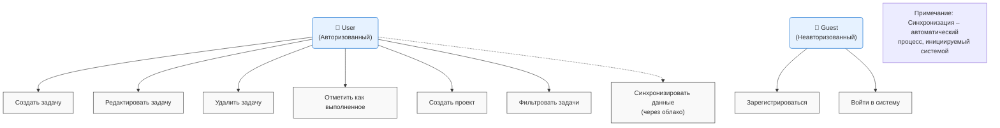
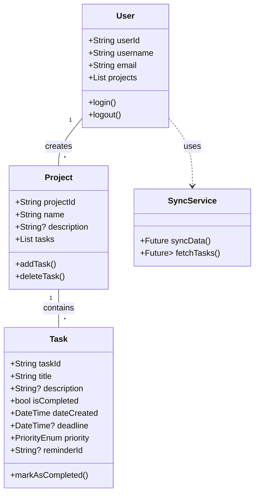

```markdown
# TaskMaster - Система управления задачами

**TaskMaster** — это кроссплатформенное приложение для управления персональными и рабочими задачами, разработанное в рамках учебной практики. Цель проекта — создание интуитивно понятного и функционального инструмента для повышения личной продуктивности.

---

## 🎯 Постановка задачи

**Цель:** Разработать современное, быстрое и удобное приложение для управления задачами, которое помогает пользователям эффективно организовывать свое время и концентрироваться на главном.

**Основные задачи проекта:**
*   Предоставить пользователю простой интерфейс для создания и отслеживания задач.
*   Реализовать систему проектов для группировки связанных задач.
*   Внедрить механизм напоминаний о дедлайнах.
*   Обеспечить синхронизацию данных между устройствами для непрерывной работы.

**Целевая аудитория:** Студенты, фрилансеры, IT-специалисты и все, кто стремится к эффективной организации своего времени.

---

## 📊 Диаграмма прецедентов (Use Case Diagram)

Диаграмма ниже иллюстрирует взаимодействие между акторами (пользователями) и системой.



**Акторы:**
*   **Гость (Guest):** Неавторизованный пользователь, который может зарегистрироваться или войти в систему.
*   **Пользователь (User):** Авторизованный пользователь, имеющий полный доступ к функционалу приложения.

---

## 👥 Пользователи и бизнес-процессы

| Роль | Описание | Ключевые бизнес-процессы |
| :--- | :--- | :--- |
| **Гость** | Новый или неавторизованный пользователь | 1. **Регистрация:** Заполнение формы для создания новой учетной записи.<br>2. **Авторизация:** Ввод учетных данных для доступа к системе. |
| **Пользователь** | Авторизованный владелец учетной записи | 1. **CRUD задач:** Создание, просмотр, редактирование и удаление задач.<br>2. **Управление проектами:** Создание и удаление проектов для организации задач.<br>3. **Отслеживание прогресса:** Отметка задач как выполненных.<br>4. **Организация:** Фильтрация и поиск задач по различным критериям.<br>5. **Синхронизация:** Автоматическое обновление данных на всех устройствах. |

---

## 🛠️ Инструменты разработки

Проект разрабатывается с использованием следующих технологий и инструментов:

| Категория | Стек |
| :--- | :--- |
| **Фронтенд** | **Flutter** (Dart) — для кроссплатформенной разработки под iOS, Android и Web. |
| **Бэкенд & База данных** | **Firebase** (Firestore, Authentication, Cloud Functions) — для быстрого прототипирования и развертывания серверной части. |
| **Управление проектом** | **Trello** — для постановки задач и отслеживания прогресса. |
| **Контроль версий** | **Git** / **GitHub** — для хранения кода и совместной работы. |
| **Дизайн и прототипирование** | **Figma** — для создания макетов пользовательского интерфейса. |
| **Среда разработки (IDE)** | **Visual Studio Code** — с плагинами для Flutter и Dart. |

---

## 📐 Диаграмма классов (Class Diagram)

Диаграмма классов описывает основную объектную модель приложения.



**Описание ключевых классов:**
*   **`User`:** Центральный класс, представляющий пользователя системы.
*   **`Project`:** Контейнер для группировки задач по темам или целям.
*   **`Task`:** Основная сущность приложения, содержащая все детали задачи.
*   **`SyncService`:** Сервисный класс, отвечающий за облачную синхронизацию.

---

## 📱 Интерфейс приложения (Эскизы)

Приложение будет состоять из следующих ключевых экранов:

1.  **Экран аутентификации:** Простой экран с полями для ввода email/пароля и кнопками "Войти" и "Зарегистрироваться".
2.  **Главный экран "Сегодня":**
    *   Список задач, запланированных на сегодня, сгруппированных по приоритету.
    *   Плавающая кнопка "+" для быстрого добавления задачи.
    *   Боковое меню для навигации между проектами и настройками.
3.  **Экран создания/редактирования задачи:**
    *   Поля: "Название", "Описание", "Выбор проекта", "Дедлайн", "Приоритет", "Напоминание".
    *   Кнопки "Сохранить" и "Отменить".
4.  **Экран проектов:** Список всех проектов с возможностью создания новых и просмотра задач внутри каждого.

*(Макеты интерфейса находятся в стадии разработки в Figma и будут добавлены в раздел `images/` позднее)*

---

## 🚀 Как запустить проект

Инструкция будет добавлена по мере разработки приложения.

---

## 📄 Лицензия

Этот проект создан в учебных целях.

---

## 👨‍💻 Разработчик

*   **[Utkin Karim]** - [karimkaa](https://github.com/karimkaa)

```

